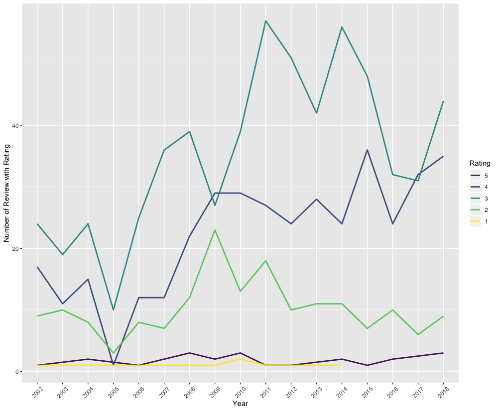
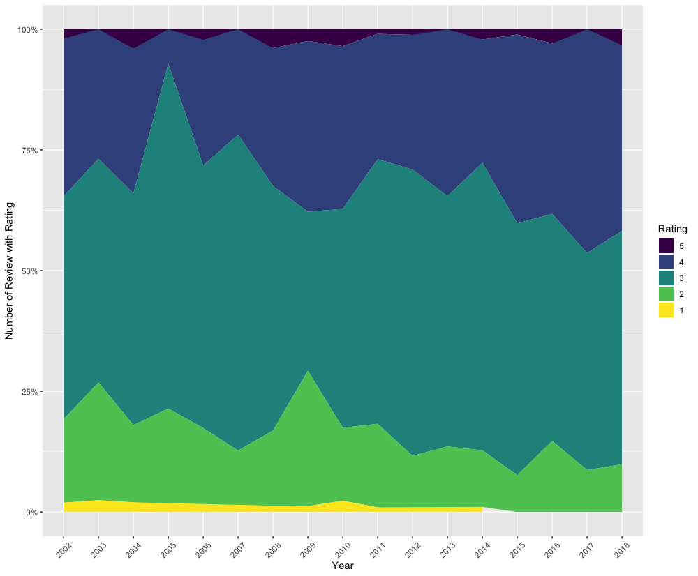
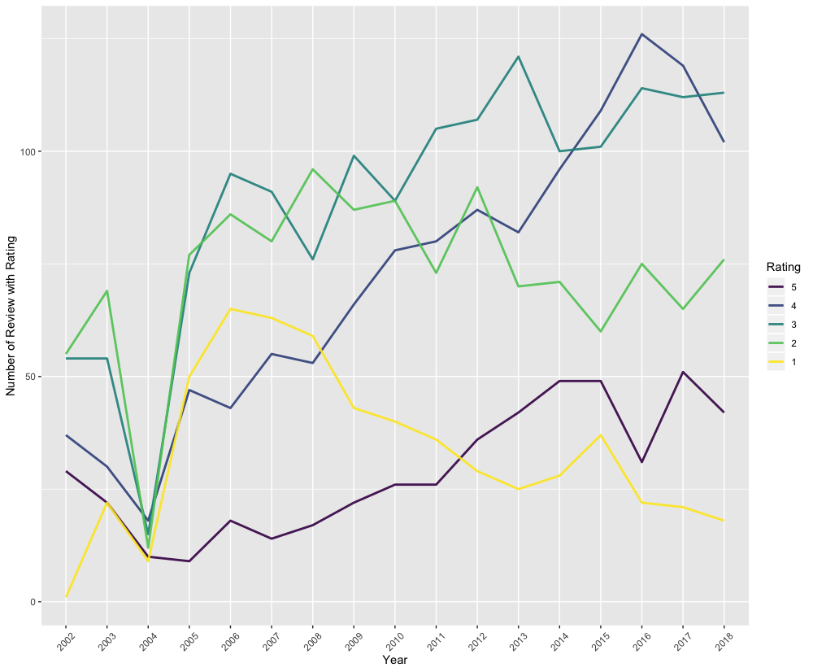
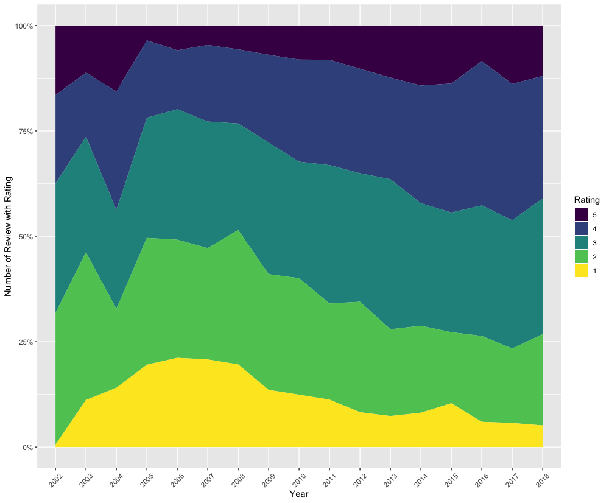
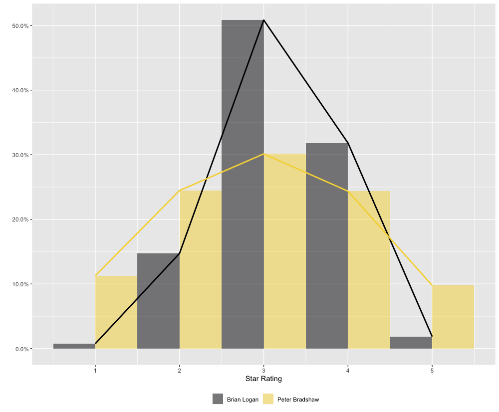

```{r setup, include = FALSE}
knitr::opts_chunk$set(
  collapse = TRUE,
  comment = "#>"
)

options("gu.API.key" = "test")
```


# Functions

`guardianapi` contains functions to search and retrieve articles, tags and editions from the [Guardian open data platform](https://open-platform.theguardian.com/documentation/).


Let's look at a few reviewers. For example, I noticed that comedy critic Brian Logan seemed to give out very few five star or one star reviews, so I wanted to see if that was true. I've included all his reviews from 2002--2018

```{r logan-example, eval=FALSE}
library(guardianapi)
library(dplyr)
library(lubridate)
library(ggplot2)

logan_search <- gu_items(query = "profile/brianlogan")

logan_search$star_rating <- as.numeric(logan_search$star_rating)

logan_reviews <- logan_search %>% 
  filter(!is.na(star_rating), 
         web_publication_date >= as.Date("2002-01-01"),
         web_publication_date <= as.Date("2018-12-31"))

logan_reviews$year <- as.factor(year(logan_reviews$web_publication_date))

logan_summary <- logan_reviews %>%
  group_by(year, star_rating) %>%
  summarise(count = n()) %>%
  mutate(perc = count/sum(count)) %>%
  ungroup() %>%
  mutate(star_rating = factor(star_rating, levels = c(5,4,3,2,1)))

p_logan <- ggplot(data = logan_summary,
                  aes(x = year, y = count, group = star_rating)) + 
  geom_line(aes(colour = star_rating), size = 1, alpha = 0.9) + 
  scale_colour_viridis_d(name = "Rating") + 
  labs(x="Year", y="Number of Review with Rating") + 
  theme(axis.text.x = element_text(angle = 45, vjust=0.5))

p_logan

```

```{r logan-example-plot, echo=FALSE, out.width = '100%'}

```


```{r logan-area, eval=FALSE}
p_logan_area <- ggplot(data = logan_summary,
                  aes(x = year, y = perc, group = star_rating)) + 
  geom_area(aes(fill = star_rating)) + 
  scale_y_continuous(labels = scales::percent) + 
  scale_fill_viridis_d(name = "Rating") + 
  labs(x="Year", y="Number of Review with Rating") + 
  theme(axis.text.x = element_text(angle = 45, vjust=0.5)) 


p_logan_area
```

```{r logan-area-plot, echo=FALSE, out.width = '100%'}

```

As you can see here, Brian Logan is pretty stingy with five star reviews, and didn't give out a single five star rating in all of 2017. Likewise, he hasn't completed panned any act with a single star since 2014.

Now let's take a look at film critic Peter Bradshaw. I've used the same time span, and I've removed the single [0-star rating](https://www.theguardian.com/culture/2002/oct/04/artsfeatures8) given to the 2008 film [Boat Trip](https://www.imdb.com/title/tt0285462/). There are more than four times as many film reviews from Peter Bradshaw as there are comedy reviews from Brian Logan over the same time period.


```{r bradshaw-example, eval=FALSE}
library(dplyr)
library(lubridate)
library(ggplot2)

bradshaw_search <- gu_items(query = "profile/peterbradshaw")

bradshaw_search$star_rating <- as.numeric(bradshaw_search$star_rating)

bradshaw_reviews <- bradshaw_search %>% 
  filter(!is.na(star_rating), star_rating != 0,
         web_publication_date >= as.Date("2002-01-01"),
         web_publication_date <= as.Date("2018-12-31"))

bradshaw_reviews$year <- as.factor(year(bradshaw_reviews$web_publication_date))

bradshaw_summary <- bradshaw_reviews %>%
  group_by(year, star_rating) %>%
  summarise(count = n()) %>%
  mutate(perc = count/sum(count)) %>%
  ungroup() %>%
  mutate(star_rating = factor(star_rating, levels = c(5,4,3,2,1)))

p_bradshaw <- ggplot(data = bradshaw_summary,
                  aes(x = year, y = count, group = star_rating)) + 
  geom_line(aes(colour = star_rating), size = 1, alpha = 0.9) + 
  scale_colour_viridis_d(name = "Rating") + 
  labs(x="Year", y="Number of Review with Rating") + 
  theme(axis.text.x = element_text(angle = 45, vjust=0.5))

p_bradshaw

```

```{r bradshaw-example-plot, echo=FALSE, out.width = '100%'}

```


```{r bradshaw-area, eval=FALSE}
p_bradshaw_area <- ggplot(data = bradshaw_summary,
                  aes(x = year, y = perc, group = star_rating)) + 
  geom_area(aes(fill = star_rating)) + 
  scale_y_continuous(labels = scales::percent) + 
  scale_fill_viridis_d(name = "Rating") + 
  labs(x="Year", y="Number of Review with Rating") + 
  theme(axis.text.x = element_text(angle = 45, vjust=0.5))

p_bradshaw_area
```

```{r bradshaw-area-plot, echo=FALSE, out.width = '100%'}

```


We can compare the distributions of ratings given by the two critics.

```{r comp-hist, eval=FALSE}

bradshaw_reviews$byline <- "Peter Bradshaw"

logan_reviews$byline <- "Brian Logan"

comp_df <- bind_rows(logan_reviews, bradshaw_reviews) %>%
  mutate(star_rating = as.numeric(star_rating))

comp_df2 <- comp_df %>%
  group_by(star_rating, byline) %>%
  summarise(count = n()) %>% group_by(byline) %>%
  mutate(perc = count/sum(count))

comp_p <- ggplot(comp_df, 
                 aes(x = star_rating, y = ..density.., fill = byline)) + 
  geom_histogram(position="dodge", bins = 5, alpha = 0.5) +
  scale_y_continuous(labels = scales::percent) +
  scale_fill_viridis_d(end = 0.9, option = "inferno") + 
  labs(x = "Star Rating", y = "", fill = "") + 
  theme(legend.position = "bottom") +
  geom_line(aes(x = star_rating, y = perc,
                colour = byline, group = byline), data = comp_df2,
            size = 1) + 
  scale_colour_viridis_d(end = 0.9, option = "inferno")  +
  guides(colour = FALSE)

comp_p
```

```{r bradshaw-logan-comp, echo=FALSE, out.width = '100%'}

```


We can also use `gu_content()` for more general queries. For example, here's all the articles returned for "relationships" between the two given dates:

```{r relationships-demo, eval=FALSE}
relations <- gu_content(query = "relationships", from_date = "2018-11-30",
                        to_date = "2018-12-30")

tibble::glimpse(relations)
```

```{r relations-read, echo=FALSE, message=TRUE, warning=TRUE}
relations <- readr::read_rds("relations.rds")

relations
```


Use the `tag` parameter to limit articles to particular sections:


```{r relations-sex-demo, eval=FALSE}
relations_sex <- gu_content(query = "relationships", from_date = "2018-11-30",
                            to_date = "2018-12-30", tag = "lifeandstyle/sex")

relations_sex
```

```{r relations-sex-read, echo=FALSE, message=TRUE, warning=TRUE}
relations_sex <- readr::read_rds("relations_sex.rds")

tibble::glimpse(relations_sex)
```

